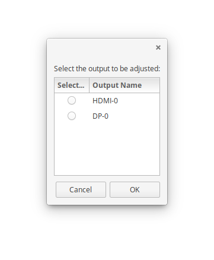

# BrightBoi
A simple bash / zenity / xrandr brightness adjuster

### Installation Instructions
Operating System Dependencies:
- Solus: `sudo eopkg install zenity xrandr`
- Ubuntu: `sudo apt-get install zenity x11-xserver-utils`

Script Installation:
1. Grab bash script: `sudo wget -O /usr/bin/BrightBoiGUI https://raw.githubusercontent.com/Justinzobel/BrightBoi/master/brightness.sh`
2. Grab menu entry: `sudo wget -O /usr/share//applications/BrightBoi.desktop https://raw.githubusercontent.com/Justinzobel/BrightBoi/master/BrightBoi.desktop`
3. Make BrightBoi executable: `sudo chmod +x /usr/bin/BrightBoiGUI`
4. Update Desktop Database: `sudo update-desktop-database`

