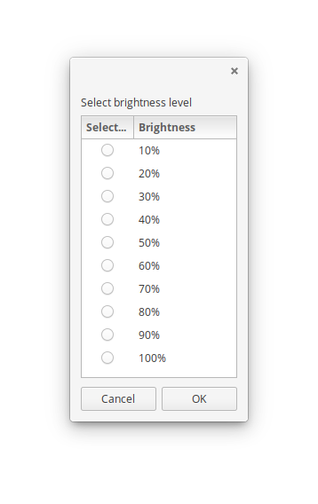

# BrightBoi
A simple bash / zenity / xrandr brightness adjuster

### Installation Instructions
Operating System Dependencies:
- Solus: `sudo eopkg install git zenity xrandr`
- Ubuntu: `sudo apt-get install git zenity x11-xserver-utils`

Script Installation:
1. clone the repository: `git clone https://github.com/justinzobel/BrightBoi`
2. check for missing dependencies: `./checkdeps`
3. if missing dependencies exist, install them before using the script.
4. run `make install` to install.

Script Uninstallation:
1. cd to the directory you cloned your repo in.
2. run `make uninstall` (with the install `PREFIX` variable if you defined it)

